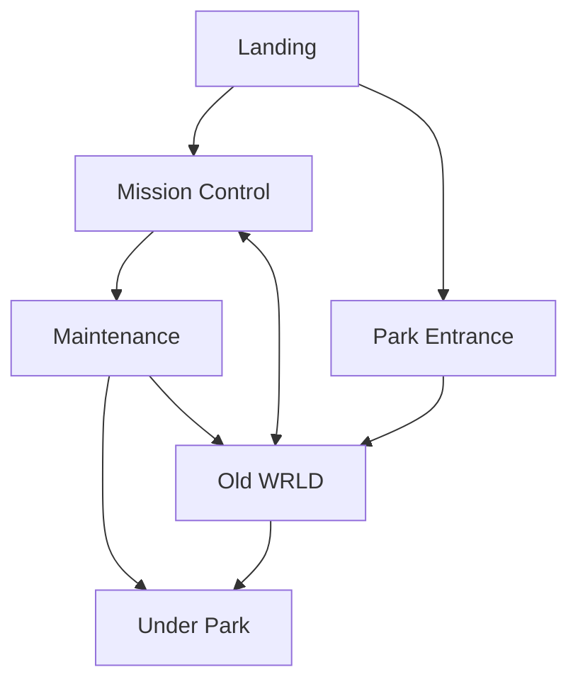

# Ye Olde WRLD

 Mothership Adventure by Burrbank 

---

## Premise

**Premise:** **Olde WRLD**. **BeyondSlick Media Corp** runs an augmented reality park. Something has gone wrong **BSMCorp** has put a call out for contractors to resolve the situation at the park. The park is located on a semi-terraformed planet (**FL-1944**) with 3 uninhabited moons orbiting a gray star. located less than **1 jump** away from some other point of interest (Space Highway, Gate, Prospero's Dream, etc.). The park is a simulacrum of 90s America before the Dark Ages II after Y2K.

---

Landing:

Park Entrance

Old WRLD

Mission Control

Maintenance

Under Park

---

## NPCs

### BSMC Operations Staff
**Hank Hass** *Director*

**Jen Peters** *Security*

**ABADON - 03**  *operations*

### Attendees Rebelion

**Leo Grant** *Visionary*

**Gretta Holton** *Raider*

**ABADON - 01/02** *intelegence*

## Park Packages

Simple Attendance Package

Altered State Package

Deep Immersion Package

## OLD WRLD

## Under Park

