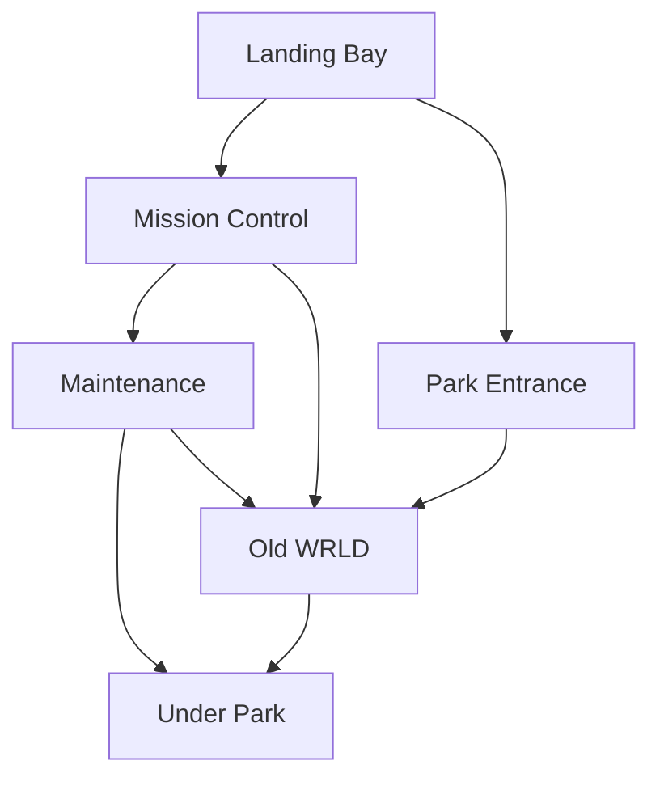

\pagebreak

# Map

## Overview

\pagebreak

**Landing Bay**:

* Docking for 6 Cruise Shuttles
* Launch Rail for reentry into space
* Mural depicting *"Historic"* scenes from the 1980s to late-1990s

**Park Entrance**:

* rows on rows of **MomentoMAX** machines
* Heavily guarded
* Entrance to Mission Control behind checkpoint
* Gift Shop

**Old WRLD**:

* Main park
* See details in **<u>Chapter 5</u>**

**Mission Control**:

* Thousands of security monitors
* Emotion stimulating gas controls
  * Rose Haze **<u>-1d5 stress/day</u>** (default setting)
  * Paranoia Mist **<u>+1d5 stress/day</u>** (for lead up to Y2K crash event)
  * !Nerve Gas! **kills all unprepared people within Old WRLD and Under Park**
* Comms to all active staff members

**Maintenance**:

* Hidden vents to the park
  * Vents to 90% of locations within OldWRLD
  * Vents to 60% of locations within the Under Park
  * Vents appear to be solid walls to **<u>fully immersed attendees</u>**
* Chemical stores / cleaning supplies
* Recharge rack for Maintenance droids **Maintenance Droid <u>C 45</u> <u>I 30</u> cleaning acid spray <u>2d20 DMG</u>**

**Under Park**:

* Discarded remains of other half baked park ideas
* See generation tables in **<u>Chapter 6</u>**

