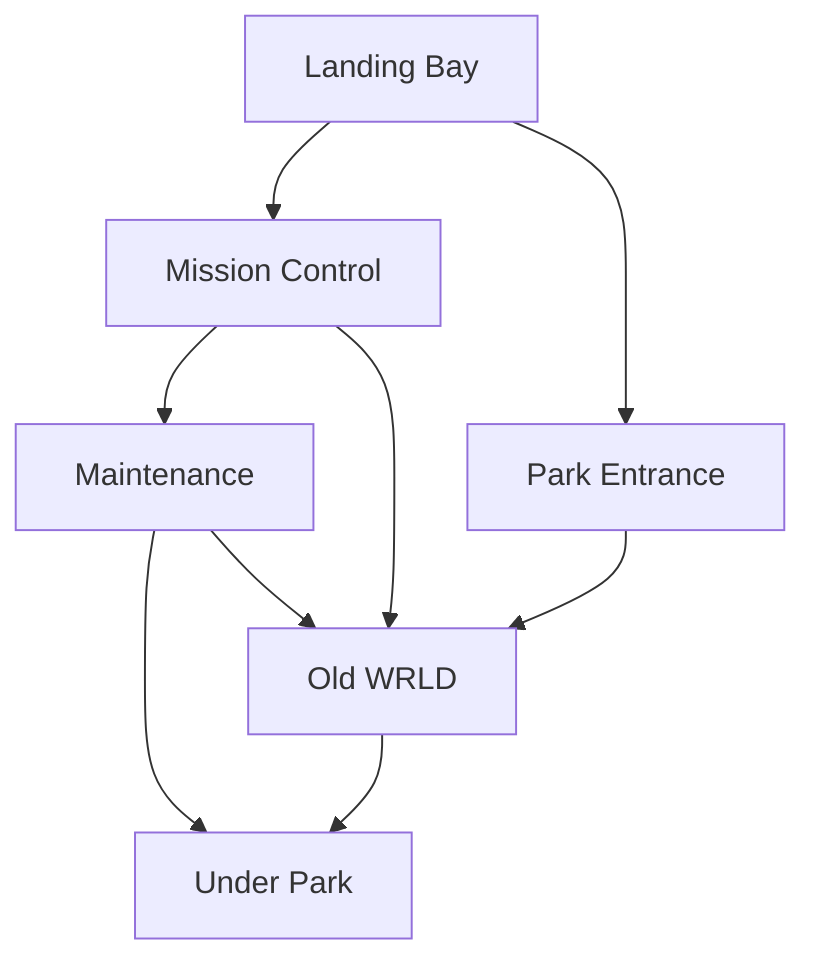

## Overview

Landing Bay:

* Docking for 6 Cruise Shuttles
* Launch Rail for reentry into space
* Mural depicting Historic scenes from the 1950s to late-1990s

Park Entrance

* rows on rows of **MomentoMAX** machines
* Heavily guarded
* Entrance to Mission Control behind checkpoint
* Gift Shop

Old WRLD

* Main park
* See details in **<u>Chapter 5</u>**

Mission Control

Maintenance

Under Park